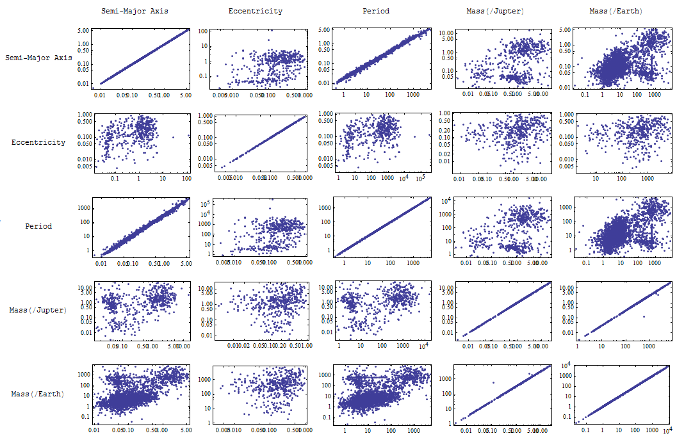
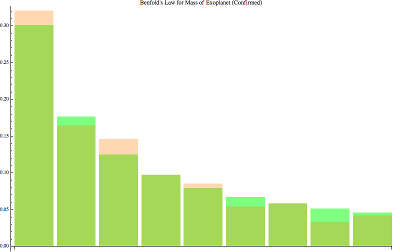
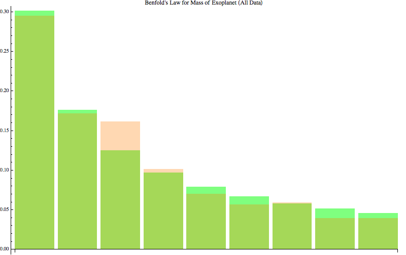

exoplanets
==========

系外行星相关的基础知识，科研进展，数据分析，可视化等。

**目录**

0. 系外行星文档
1. 可视化
2. exoplanets 与 Benfold's Law

## 系外行星文档

[文档浏览地址在此](http://exoplanets.readthedocs.org/zh_CN/latest/)。

本文档使用 [reStructuredText](http://docutils.sourceforge.net/rst.html) 写成，并在 [readthedocs](https://readthedocs.org/projects/exoplanets/) 上生成。当然，也可以使用 [Sphinx](http://sphinx-doc.org/) 离线生成。

文档的 source 在 `docs` 目录内，readthedocs 会自动搜索 `conf.py` 自动找到目录地址。所以请勿在本仓库内创建其他名为 `conf.py` 的文件。

##  可视化

## Benford's Law

[Benford's Law on wikipedia](https://en.wikipedia.org/wiki/Benford's_law)

Data from Mathematica AstronomicalData which is quite outdated.

More recent data of confirmed exoplanets,

More recent data of all exoplanets including unconfirmed ones,

=======
橙色是 exoplanet 质量，绿色是 Benford's Law 的理论值。比较接近。太奇怪。

半径数据并不遵守此项定律。
