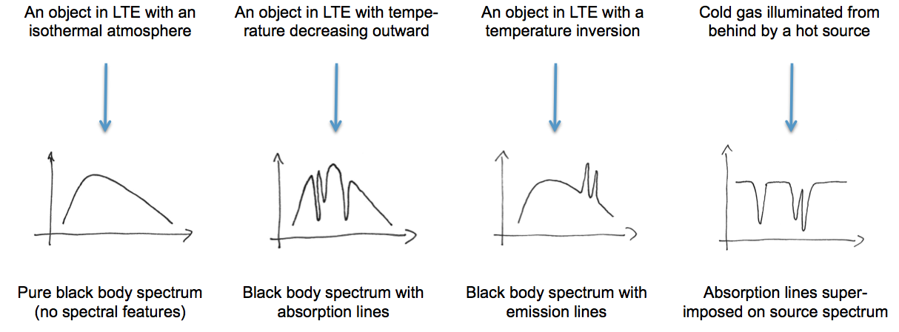
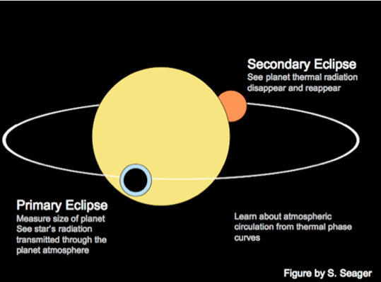
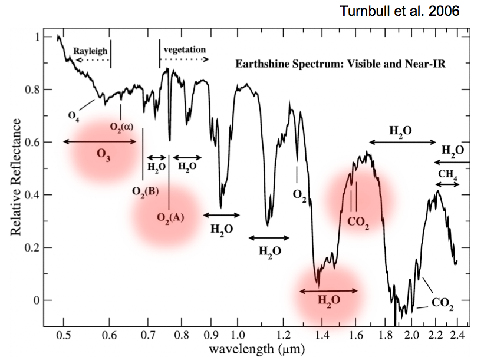

行星大气
=============

除了行星的轨道的信息，我们同样想要知道行星本身的性质，比如密度，成分，甚至大气。

通过平均质量和密度关系，我们可以判断行星的可能成分。

.. figure:: assets/atmosphere/massVSdensity.png
   :align: center

   图片：C. Lovis April 2014. 可见行星的质量和平均密度差别很大。红线是指的完全由岩石组成的行星，蓝线是完全由水组成的行星。

.. figure:: assets/atmosphere/radiusVSMass.png
   :align: center

   图片来源：`arXiv:1310.7987 <http://arxiv.org/abs/1310.7987>`_ . 半径-质量图。

我们发现的行星中，有很多质量密度关系很奇怪的行星，目前数据还不足以理解。为了获取更多的信息，一个比较重要的方法是获得行星的光谱，从而获得行星的化学成分的信息。

基础知识
--------------

.. index:: Spectrum

理解光谱
~~~~~~~~~~

.. admonition:: 几个有用的概念
   :class: note

   可以从 wikipedia 来获取相关词条，来了解更多的相关知识。

   * 黑体辐射

   .. figure:: assets/atmosphere/blackbody.png
      :align: center

      黑体谱是理想的情况下，完全平衡的情况下的光谱。可见光只占了黑体谱的很小的一部分。

   * 热平衡

   实际上天体物理中常用的是局域的热平衡（Local Thermal Equilibrium, LTE）。

   * 辐射转移

   * 光深度

下图是几种可能的光谱，光谱确实可能为我们提供很多的信息。

   第一种是黑体谱，没有吸收，没有部分衰减；第二种是光源有温度差，不同温度的分层，越往外温度越低，会对不同波长的电磁波有不同的吸收和发射；第三种是越往外温度越高的温度差异；第四种是一个气体被背后的光源照亮，然后产生的吸收谱。

化学成分
~~~~~~~~~~~~~~~~~~

系外行星上有哪些化学成分呢？

先来看看我们太阳系的情况

.. figure:: assets/atmosphere/elementAbundance.png
   :align: center

   氢和氦是最多的，其次是氧、碳和氮。原子数越多，基本上含量迅速减少。

有了元素的分布，我们可以定性的估计哪些化学成分会比较多。

.. figure:: assets/atmosphere/chemical.png
   :align: center

   氢气，氦气，各类氧化物，氮化物。根据温度的不同，可能的存在状态也不同。

那么如何探测这些化学成分呢？一种可行的方法是使用光谱。我们可以计算辐射转移方程来获得最终的可能的光谱。一些可能的化学成分的特征可以从下面的几点来获得。

1. 分子原子的电子跃迁会产生不同的谱线；
2. 分子的转动-振动谱线；
3. 散射，包括瑞利散射（散射粒子远小于光波长）和米散射（散射粒子大于光波长）。

.. figure:: assets/atmosphere/atmosphereAtomMolecular.png
   :align: center

   对于不同的波长，不同的化学分子有不同的散射界面。散射界面越小，就显得越透明。来源：Burrows 2014

图中有一个有趣的例子是二氧化碳。二氧化碳的散射界面在波长比较长的时候变得很大，可以将这些波长“囚禁”起来，而这些波长正好是产生热效应的波长，所以二氧化碳是一种温室气体。

压强-温度关系
~~~~~~~~~~~~~~~~~~

.. admonition:: 大气压强——热力学
   :class: note

   我们可以导出大气压强和高度的关系（近似）

   .. math::
      \frac{dP(z)}{dz} = -\rho g,

   方程左边是压力差/面积，方向向上，右边是单位体积的重力作用，方向向下，所以有个负号。通过量纲检查发现这个方程量纲正确。

   从物理本科的热力学课程，对于理想气体，我们可以知道状态方程是

   .. math::
      P = \frac{\rho}{\mu}kT.

   这样把第二个方程代入第一个方程，可以导出压强随着高度变化的解，

   .. math::
      P(z) = P_0 e^{-z/H},

   其中 :math:`H=\frac{kT}{\mu g}`.

大气中的能量的传输有两种主要的方式，辐射和对流，这两种方式都可以跟温度差有关。

区分恒星光谱和行星光谱
-----------------------------------

如果要区分两者光谱，理想的情况是我们能够直接有足够的角分辨率，从而能够从仪器中直接将行星和恒星分开。然而这是非常困难的。除了角分辨率的问题，行星相比于恒星实在太暗了，要比恒星暗 :math:`10^{-3}` 到 :math:`10^{-10}` 倍。

.. admonition:: 几个数字
   :class: note

   假定我们从 10pc 远的地方看太阳系，想要分辨出地球和太阳，那么我们需要最小 0.1 弧秒的分辨率。然而，光学望远镜有一个光学上的衍射极限，直径 1.3m 的望远镜，衍射极限就是 0.1 弧秒，角分辨率不能比这个更加小。

然而技术的进步，我们现在已经能够直接看到一些行星了。例如 `HR 8799 <https://en.wikipedia.org/wiki/HR_8799>`_

.. image:: assets/atmosphere/Benjamin_Zuckerman_HR_8799_planets_image_Dec._2010.jpg
   :align: center

这是些年轻的行星，行星本身的温度比较高，而且距离恒星比较远，所以探测起来要容易的多。然而，更加吸引我们的是那些像地球一样的行星，所以我们暂时还需要寻求另外的方法。

一个很神奇的方法是使用凌日。当行星位于我们和恒星之间的时候，我们看到的光谱是包括行星的，但是当行星移动到恒星的背面，我们观测到的光谱就没有行星的成分了。通过对照这两类光谱，我们可以获得一些行星光谱的信息。

透射光谱
~~~~~~~~~~~~~~~~~~~

前面我们看到，对于不同的波长，大气的透明度不同，所以当我们观测不同的波长的时候，我们会看到不同大小的行星。对于某些相对大气不透明的波长，因为行星大气底层密度大的区域阻止了光的通过，所以会看到一个更大的行星。当我们观测另外一些特别透明的波长的时候，我们会看到更小的行星。

.. admonition:: 透射光谱
   :class: note

我们可以计算大气在什么样的高度上就变得透明了，当然这个透明度跟散射界面有关。

.. math::
   z(\lambda) = H (\ln \sigma(\lambda)+\text{\Const})

也就是说，散射界面越大，这个高度就越大。而这里面 :math:`H=\frac{kT}{\mu g}`是一个跟行星大气的特征有关的量。这样我们结合不同波长的观测的结果，就可以计算行星大气。另外，我们还可以根据对不同波长的透明度推断行星大气的化学成分。

.. admonition:: 实例
   :class: note

   .. figure:: assets/atmosphere/transmission1.png
      :align: center

      **HD 209458b**， 右侧的巨大的峰值显示了水蒸气的透射波长。

   .. figure:: assets/atmosphere/transmission2.png
      :align: center

      **HD 189733b**，红线是观测结果，逐渐降低的半径显示了很可能有雾气或者云层导致瑞利散射。

   .. figure:: assets/atmosphere/transmission4.png
      :align: center

      **GJ 1214b**，几乎水平的结果暗示这颗行星有云层或者雾气。

热发射谱
~~~~~~~~~~~~~~~~~~~~~

.. figure:: assets/atmosphere/600px-Black_body.svg.png
   :align: center

   黑体辐射

如果行星吸收的所有的能量跟他释放的能量相同，那么这个行星处在热平衡，这时候（吸收或者放出的能量所对应）的温度叫做平衡温度:math:`T_{eq}`；如果我们假定行星是黑体，他放出的总的辐射的能量，所对应的黑体温度，就做有效温度 :math:`T_{eff}`。通过计算，我们可以得出

.. math::
   T_{eq} = T_{eff}\sqrt{R_s}{a}\left(\frac{1-A_B}{4}\right)^{1/4}.

其中 :math:`A_B` 是 bond albedo，即没有被吸收的能量占总的入射能量的比值。

我们可以定义热发射流量比，即恒星的热发射的流量与恒星的比值，

.. math::
   \frac{F_p(\lambda)}{F_s(\lambda)} = \left(\frac{R_p}{R_s}\right)^2 \sqrt{R_s}{a}\left(\frac{1-A_B}{4}\right)^{/4}.

可以发现右侧是一些跟轨道半长轴 a，恒星行星半径 :math:`R_p`，恒星半径 :math:`R_s`，:math:`A_B` 有关的量，而左边是观测值，这样我们通过对不同波长的对比，可以得到很多行星大气的信息。

.. figure:: assets/atmosphere/hd189733b.png
   :align: center

   **HD 189733b**，一颗被潮汐锁定的行星，下面一张图是夜晚部分的曲线，显然要比白天部分的要冷。

其他方式
~~~~~~~~~~~~~~

行星也会有反射光谱，因为观测反射光谱也是一种可能的方法。

   地球的反射光谱，可以看到非常多的细节，包括化学成分。

参考及尾注
--------------------------

本文参考 Couresera 课程 `The Diversity of Exoplanets <https://class.coursera.org/extrasolarplanets-001>`_ .

一篇关于如何探测工业文明的文章: `arXiv:1406.3025 <http://arxiv.org/abs/1406.3025>`_ 。
