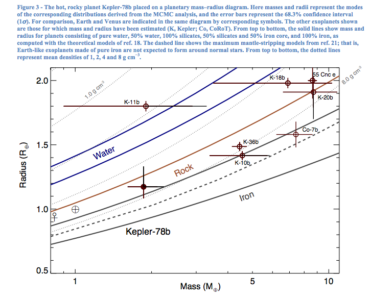
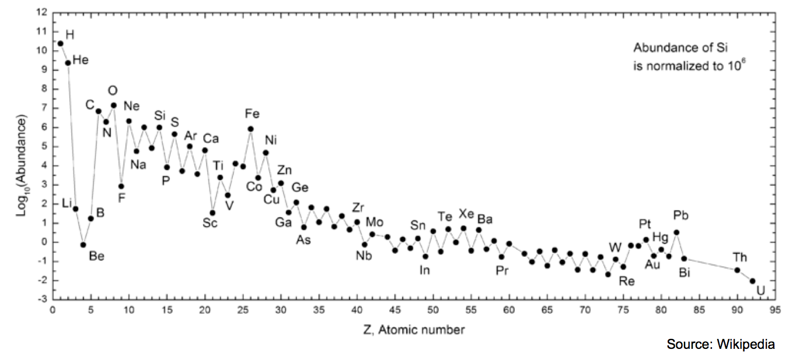

行星大气
=============

除了行星的轨道的信息，我们同样想要知道行星本身的性质，比如密度，成分，甚至大气。

通过平均质量和密度关系，我们可以判断行星的可能成分。

.. figure:: assets/atmosphere/massVSdensity.png
   :align: center

   图片：C. Lovis April 2014. 可见行星的质量和平均密度差别很大。红线是指的完全由岩石组成的行星，蓝线是完全由水组成的行星。

   图片来源：`arXiv:1310.7987 <http://arxiv.org/abs/1310.7987>`_ . 半径-质量图。

我们发现的行星中，有很多质量密度关系很奇怪的行星，目前数据还不足以理解。为了获取更多的信息，一个比较重要的方法是获得行星的光谱，从而获得行星的化学成分的信息。

基础知识
--------------

理解光谱
~~~~~~~~~~

.. admonition:: 几个有用的概念
   :class: note

   可以从 wikipedia 来获取相关词条，来了解更多的相关知识。

   * 黑体辐射

   .. figure:: assets/atmosphere/blackbody.png
      :align: center

      黑体谱是理想的情况下，完全平衡的情况下的光谱。可见光只占了黑体谱的很小的一部分。

   * 热平衡

   实际上天体物理中常用的是局域的热平衡（Local Thermal Equilibrium, LTE）。

   * 辐射转移

   * 光深度

下图是几种可能的光谱，光谱确实可能为我们提供很多的信息。

.. figure:: assets/atmosphere/emergentSpectra.png
   :align: center

   第一种是黑体谱，没有吸收，没有部分衰减；第二种是光源有温度差，不同温度的分层，越往外温度越低，会对不同波长的电磁波有不同的吸收和发射；第三种是越往外温度越低的温度差异；第四种是一个气体被背后的光源照亮，然后产生的吸收谱。

化学成分
~~~~~~~~~~~~~~~~~~

系外行星上有哪些化学成分呢？

先来看看我们太阳系的情况

   氢和氦是最多的，其次是氧、碳和氮。原子数越多，基本上含量迅速减少。

有了元素的分布，我们可以定性的估计哪些化学成分会比较多。

.. figure:: assets/atmosphere/chemical.png
   :align: center

   氢气，氦气，各类氧化物，氮化物。根据温度的不同，可能的存在状态也不同。

那么如何探测这些化学成分呢？一种可行的方法是使用光谱。我们可以计算辐射转移方程来获得最终的可能的光谱。一些可能的化学成分的特征可以从下面的几点来获得。

1. 分子原子的电子跃迁会产生不同的谱线；
2. 分子的转动-振动谱线；
3. 散射，包括瑞利散射（散射粒子远小于光波长）和米散射（散射粒子大于光波长）。

.. figure:: assets/atmophere/atmosphereAtomMolecular.png
   :align: center

   对于不同的波长，不同的化学分子有不同的散射界面。散射界面越小，就显得越透明。来源：Burrows 2014

图中有一个有趣的例子是二氧化碳。二氧化碳的散射界面在波长比较长的时候变得很大，可以将这些波长“囚禁”起来，而这些波长正好是产生热效应的波长，所以二氧化碳是一种温室气体。

压强-温度关系
~~~~~~~~~~~~~~~~~~

参考及尾注
--------------------------

本文参考 Couresera 课程 `The Diversity of Exoplanets <https://class.coursera.org/extrasolarplanets-001>`_ .

一篇关于如何探测工业文明的文章。
