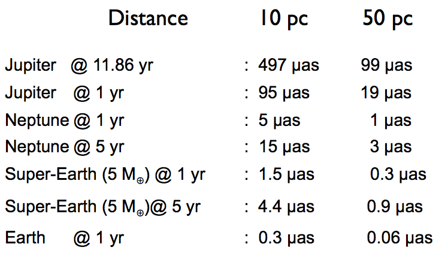

系外行星的探测
=================

系外行星的探测方法有两大类，直接探测和间接探测。

径向速度法
--------------

在之前的理论的讨论中，我们提到了轨道平面不一定平行于我们的视线。

.. figure:: assets/detection/tiltedOrbitPlane.png
   :align: center
   :alt: 投影平面

   轨道平面有个倾角 :math:`i`。

原则上说只要轨道平面不是垂直于我们的视线，我们就可以观测到恒星在行星的作用下的前后摆动，即恒星有径向的速度变化。

恒星在我们的视线方向的运动速度是

.. math::
   v_{rad} &= k\left( \cos(\Lambda(t))+e\cos\omega \right) \\
   k & = \frac{2\pi a_1\sin i}{P\sqrt{1-e^2}}

其中的 :math:`k` 是径向运动的幅值，也是我们最关心的部分。而从上图可以看出 :math:`i` 是轨道的倾角，当然倾角越大，径向运动越明显。

在实际的观测中，周期是容易获得的量，而半长轴并不是。不过我们可以通过开普勒丁三定律把径向运动的幅值跟天体的质量联系起来，

.. math::
   k =C \frac{2\pi m_2 \sin i}{P^{1/3} (m_1+m_2)^{2/3}\sqrt{1-e^2}}.

这样我们可以看出，行星的质量越大，恒星质量越小，周期越短，轨道的偏心率越大，能够观测的径向速度幅值越大。不过值得注意的是，只要我们能够看到恒星，这种方法跟我们和恒星的距离无关，是一种普适性比较好的方法。

对于太阳来说，我们可以看几个例子 [1]_ ，

.. figure:: assets/detection/radialVelocitySolar.png
   :align: center
   :alt: 太阳的径向运动

   这张图表给出了以太阳为例，不同质量的天体在不同的轨道半径的地方所引起的太阳的径向运动的数值。可见这都是些很小的数值。

下面的问题是，这些径向运动都这么小，我们如何探测恒星的这种径向运动呢？

.. figure:: assets/detection/raidalSpectrumESO1035g.gif
   :align: center

   恒星的运动带来的光谱变化。视频：`raidalSpectrumESO1035g.m4v <assets/detection/raidalSpectrumESO1035g.m4v>`_ 。来源：`The radial velocity method for finding exoplanets | ESO <http://www.eso.org/public/usa/videos/eso1035g/>`_

HARPS 的光谱测量可以达到 1 m/s 的径向速度测量精度。而这要求仪器能够测量 15 纳米的波长变化，或者说要去能够测量 1/1000 的 CCD 上的单像素上的变化。这样也就需要我们把仪器的温度降低到足够低，使得热涨落降低到不影响我们测量的程度。

然而，径向速度法所遇到的困难是，因为恒星在长时间上会有一些活动，从而导致光谱的变化，所以这种方法在测量长周期的天体的时候，需要考虑到恒星本身的变化。

天体测量学
--------------

天体测量学（Astrometry）是测量天体位置的一个天文学分支。我们之前看到过我们的太阳其实一直在变动位置。

.. image:: assets/detection/Solar_System_Barycenter_2000-2050.png
   :align: center

那么，如果我们能够时刻监测恒星的位置，我们就可以推导出行星的状况。

理论上来说，我们的测量需要能够精确的分辨出的一个很大的距离上的变化。一颗距离我们 :math:`d` （单位：秒差距）的恒星，距离的变化最大为长轴的长度 :math:`2a_1`。也就是说，量化之后，需要能够分辨如下一个份数（乘坐 astrometric signature）。

.. math::
   \alpha_1 = \frac{a_1}{d} = \frac{m_2}{d}\left(\frac{P}{m_1+m_2}\right)^{2/3}.

实际的测量中，我们可以获得周期 :math:`P`，恒星距离我们的距离 :math:`d` 也可以测得，如果我们知道这个 astrometric signature，那么我们就可以获得两个质量的关系。实际上恒星的质量可以推算出来，所以我们就可以得知行星的质量。

因为行星的质量常常远远小于恒星的质量，:math:`m_2\ll m_1`，

.. math::
   m_2 = \alpha_1 d \left(\frac{m_1}{m_2}\right)^{2/3}

可以看到对于长周期的情况，astrometric signature 更大，也就更容易测量。

.. admonition:: 证明
   :class: note

   这里我们可以使用泰勒展开来获得 :math:`m_2\ll m_1` 的情况下的公式。

   我们知道 :math:`1/(1+m_2/m_1)\approx 1`，所以 astrometric signature 的式子可以简化成，

   .. math::
      \alpha_1 = \frac{m_2}{d} \left(\frac{P}{m_1}\right)^{2/3}.

为了有些数值上的经验，下图是几个例子。[1]_

天体测量学方法的问题是，我们需要测量非常非常小的角度。而且，越远的恒星，astrometric signature 就越小，越难测量，所以这是一种跟恒星距离有关的测量方法。但是这种方法的特点是，对于长周期的情况，这种方法会越准确，越容易测量。恰好跟径向速度方法构成互补。

.. figure:: assets/detection/Gaia_spacecraft.jpg
   :align: center

   来源：Wikipedia `File:Gaia spacecraft.jpg <https://en.wikipedia.org/wiki/File:Gaia_spacecraft.jpg>`_

ESA 发射了 `GAIA 卫星 <http://www.esa.int/spaceinvideos/Videos/2013/12/Inside_Gaia_s_billion-pixel_camera>`_ ，用来精确测量距离并且探测巨行星。以下视频来自 `ESA <http://www.esa.int/spaceinvideos/Videos/2013/12/Inside_Gaia_s_billion-pixel_camera>`_ .

.. raw:: html

   <iframe src="http://www.esa.int/spaceinvideos/content/view/embedjw/424168" width="640" height="360" frameborder="0"></iframe>

直接影像
----------------

.. figure:: assets/detection/directImaging.jpg
   :align: center

   直接影像法。来源：Wikipedia `File:444226main exoplanet20100414-a-full.jpg <https://zh.wikipedia.org/wiki/File:444226main_exoplanet20100414-a-full.jpg>`_

由于行星反射的光子太少，加上恒星的掩盖，直接拍摄行星的影像非常困难。然而通过一些技术手段，这是可以做到的，而且这种方法的优点也很显著。

相比于之前的天体测量学方法，这种方法需要测量的角度就不需要那么小了，因为我们现在是在测量行星的轨道，而不是恒星的。

然而，想要直接看到行星，我们需要一个大口径的望远镜，而大口径的望远镜受到大气扰动的影响就越大。解决这个问题的方式是使用 adaptive optics. 下面来自 `ESO <http://www.eso.org/public/videos/adaptiveopticsandmask/>`_ 的视频清楚的展示了大气扰动的问题和自适应光学方法的效果。

.. raw:: html

   
Loading player...

.. [1] 来自 `Coursera 的 The Diversities of Exoplanets <https://class.coursera.org/extrasolarplanets-001>`_
