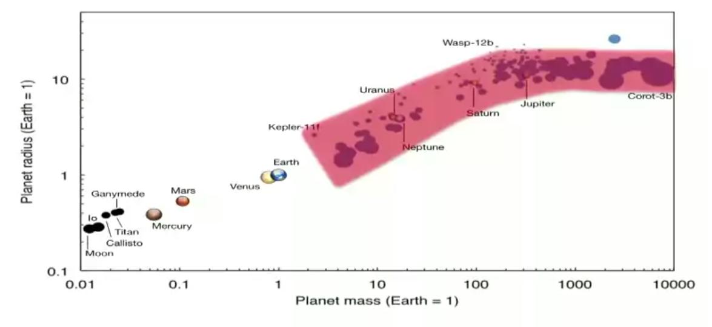

系外行星的探测
=================

系外行星的探测方法有两大类，直接探测和间接探测。

径向速度法
--------------

在之前的理论的讨论中，我们提到了轨道平面不一定平行于我们的视线。

.. figure:: assets/detection/tiltedOrbitPlane.png
   :align: center
   :alt: 投影平面

   轨道平面有个倾角 :math:`i`。

原则上说只要轨道平面不是垂直于我们的视线，我们就可以观测到恒星在行星的作用下的前后摆动，即恒星有径向的速度变化。

恒星在我们的视线方向的运动速度是

.. math::
   v_{rad} &= k\left( \cos(\Lambda(t))+e\cos\omega \right) \\
   k & = \frac{2\pi a_1\sin i}{P\sqrt{1-e^2}}

其中的 :math:`k` 是径向运动的幅值，也是我们最关心的部分。而从上图可以看出 :math:`i` 是轨道的倾角，当然倾角越大，径向运动越明显。

在实际的观测中，周期是容易获得的量，而半长轴并不是。不过我们可以通过开普勒丁三定律把径向运动的幅值跟天体的质量联系起来，

.. math::
   k =C \frac{2\pi m_2 \sin i}{P^{1/3} (m_1+m_2)^{2/3}\sqrt{1-e^2}}.

这样我们可以看出，行星的质量越大，恒星质量越小，周期越短，轨道的偏心率越大，能够观测的径向速度幅值越大。不过值得注意的是，只要我们能够看到恒星，这种方法跟我们和恒星的距离无关，是一种普适性比较好的方法。

对于太阳来说，我们可以看几个例子 [1]_ ，

.. figure:: assets/detection/radialVelocitySolar.png
   :align: center
   :alt: 太阳的径向运动

   这张图表给出了以太阳为例，不同质量的天体在不同的轨道半径的地方所引起的太阳的径向运动的数值。可见这都是些很小的数值。

下面的问题是，这些径向运动都这么小，我们如何探测恒星的这种径向运动呢？

.. figure:: assets/detection/raidalSpectrumESO1035g.gif
   :align: center

   恒星的运动带来的光谱变化。视频：`raidalSpectrumESO1035g.m4v <assets/detection/raidalSpectrumESO1035g.m4v>`_ 。来源：`The radial velocity method for finding exoplanets | ESO <http://www.eso.org/public/usa/videos/eso1035g/>`_

HARPS 的光谱测量可以达到 1 m/s 的径向速度测量精度。而这要求仪器能够测量 15 纳米的波长变化，或者说要去能够测量 1/1000 的 CCD 上的单像素上的变化。这样也就需要我们把仪器的温度降低到足够低，使得热涨落降低到不影响我们测量的程度。

然而，径向速度法所遇到的困难是，因为恒星在长时间上会有一些活动，从而导致光谱的变化，所以这种方法在测量长周期的天体的时候，需要考虑到恒星本身的变化。

天体测量学
--------------

天体测量学（Astrometry）是测量天体位置的一个天文学分支。我们之前看到过我们的太阳其实一直在变动位置。

.. image:: assets/detection/Solar_System_Barycenter_2000-2050.png
   :align: center

那么，如果我们能够时刻监测恒星的位置，我们就可以推导出行星的状况。

理论上来说，我们的测量需要能够精确的分辨出的一个很大的距离上的变化。一颗距离我们 :math:`d` （单位：秒差距）的恒星，距离的变化最大为长轴的长度 :math:`2a_1`。也就是说，量化之后，需要能够分辨如下一个份数（乘坐 astrometric signature）。

.. math::
   \alpha_1 = \frac{a_1}{d} = \frac{m_2}{d}\left(\frac{P}{m_1+m_2}\right)^{2/3}.

实际的测量中，我们可以获得周期 :math:`P`，恒星距离我们的距离 :math:`d` 也可以测得，如果我们知道这个 astrometric signature，那么我们就可以获得两个质量的关系。实际上恒星的质量可以推算出来，所以我们就可以得知行星的质量。

因为行星的质量常常远远小于恒星的质量，:math:`m_2\ll m_1`，

.. math::
   m_2 = \alpha_1 d \left(\frac{m_1}{m_2}\right)^{2/3}

可以看到对于长周期的情况，astrometric signature 更大，也就更容易测量。

.. admonition:: 证明
   :class: note

   这里我们可以使用泰勒展开来获得 :math:`m_2\ll m_1` 的情况下的公式。

   我们知道 :math:`1/(1+m_2/m_1)\approx 1`，所以 astrometric signature 的式子可以简化成，

   .. math::
      \alpha_1 = \frac{m_2}{d} \left(\frac{P}{m_1}\right)^{2/3}.

为了有些数值上的经验，下图是几个例子。[1]_

.. image:: assets/detection/astrometrySolar.png
   :align: center

天体测量学方法的问题是，我们需要测量非常非常小的角度。而且，越远的恒星，astrometric signature 就越小，越难测量，所以这是一种跟恒星距离有关的测量方法。但是这种方法的特点是，对于长周期的情况，这种方法会越准确，越容易测量。恰好跟径向速度方法构成互补。

.. figure:: assets/detection/Gaia_spacecraft.jpg
   :align: center

   来源：Wikipedia `File:Gaia spacecraft.jpg <https://en.wikipedia.org/wiki/File:Gaia_spacecraft.jpg>`_

ESA 发射了 `GAIA 卫星 <http://www.esa.int/spaceinvideos/Videos/2013/12/Inside_Gaia_s_billion-pixel_camera>`_ ，用来精确测量距离并且探测巨行星。以下视频来自 `ESA <http://www.esa.int/spaceinvideos/Videos/2013/12/Inside_Gaia_s_billion-pixel_camera>`_ .

.. raw:: html

   <iframe src="http://www.esa.int/spaceinvideos/content/view/embedjw/424168" width="640" height="360" frameborder="0"></iframe>

直接影像
----------------

.. figure:: assets/detection/directImaging.jpg
   :align: center

   直接影像法。来源：Wikipedia `File:444226main exoplanet20100414-a-full.jpg <https://zh.wikipedia.org/wiki/File:444226main_exoplanet20100414-a-full.jpg>`_

由于行星反射的光子太少，加上恒星的掩盖，直接拍摄行星的影像非常困难。然而通过一些技术手段，这是可以做到的，而且这种方法的优点也很显著。

相比于之前的天体测量学方法，这种方法需要测量的角度就不需要那么小了，因为我们现在是在测量行星的轨道，而不是恒星的。

然而，想要直接看到行星，我们需要一个大口径的望远镜，而大口径的望远镜受到大气扰动的影响就越大。解决这个问题的方式是使用 adaptive optics. 下面来自 `ESO <http://www.eso.org/public/videos/adaptiveopticsandmask/>`_ 的视频清楚的展示了大气扰动的问题和自适应光学方法的效果。

.. raw:: html

   
Loading player...

凌日法
------

利用行星对恒星光源的遮挡，我们可以探测行星。

一个非常好的理解凌日现象的例子是金星凌日：

.. figure:: https://upload.wikimedia.org/wikipedia/commons/thumb/0/07/NASA%27s_SDO_Satellite_Captures_First_Image_of_2012_Venus_Transit_%28Full_Disc%29.jpg/768px-NASA%27s_SDO_Satellite_Captures_First_Image_of_2012_Venus_Transit_%28Full_Disc%29.jpg
   :align: center

   来源：Wikipedia: `File:SDO Satellite Captures First Image of 2012 Venus Transit <https://en.wikipedia.org/wiki/File:NASA%27s_SDO_Satellite_Captures_First_Image_of_2012_Venus_Transit_(Full_Disc).jpg>`_

为了看得更明白些，我们看看下面这张 gif 图片：

.. figure:: https://upload.wikimedia.org/wikipedia/commons/8/82/Astronomical_Transit.gif
   :align: center

   来源：Wikipedia: `File:Astronomical Transit.gif <https://en.wikipedia.org/wiki/File:Astronomical_Transit.gif>`_

这样当恒星被行星遮挡的时候，我们就会看到恒星的亮度有个降低，因为行星的遮挡是周期性的，我们可以看到周期性的亮度曲线的降低。

.. figure:: https://upload.wikimedia.org/wikipedia/commons/thumb/8/8a/Planetary_transit.svg/800px-Planetary_transit.svg.png
   :align: center

   来源：Wikipedia: `File:Planetary transit.svg <https://commons.wikimedia.org/wiki/File:Planetary_transit.svg>`_

**一个需要考虑的问题是，系外行星中，我们能够观测到的这种现象需要什么条件呢？**

倘若轨道平面的法向正对我们，那么我们是没法在地球这边观测到的。

.. figure:: assets/detection/exoplanetsTransitNonTrasit.png
   :align: center

   来源：` LCOGT <http://lcogt.net/spacebook/transit-method>`_

假设所有行星的轨道平面是随机分布的，那么我们观测能够观测到一个行星凌日的概率是跟以下几个因素相关的：

1. 行星的大小。行星越大，对恒星的遮挡越大。
2. 恒星的大小。恒星越大，同样大小的行星对它的遮挡越小。
3. 行星距离恒星的距离。行星距离恒星越近，对于一定距离外的观测者，观测到的可能性越大。
4. 行星的周期。行星的周期太长，我们可能不能等到完成一个周期的观测。

.. figure:: assets/detection/shadowZone.png
   :align: center

   来源：Winn et al. 2010. 如果我们正好在行星形成的阴影区中，我们就能看到。否则我们没法看到。

这样我们实际上可以计算我们看到凌日的概率，

.. math::
   P_{tra}= \left(\frac{R_{S}\pm R_p}{a}\right) \left( \frac{1+e \sin\omega}{1-e^2} \right)

这里面 :math:`a` 是半长轴，:math:`R_{S}` 和 :math:`R_p` 分别是恒星和行星的半径，:math:`e` 是轨道偏心率。

一个值得注意的是，即便第一项很小，轨道的偏心率足够大的话，我们可以将概率提高很多倍。因此实际上这种方法要比一开始想象的要实用的多。只需要一台小望远镜，我们也能够发现这种现象。

设想如果行星的大小跟恒星的大小差不多，这样我们可以几乎观测到一个完成想“日食”。而且如果轨道半径足够短，这种日蚀的的周期也会足够短，更容易被观测到。因此，凌日法对于 hot jupters 的观测来说，是一种非常强大的方法。

一般讨论
~~~~~~~~~~

我们可以通过观察凌日光变曲线来精确的计算很多系统的属性。

.. figure:: assets/detection/transitInTime.png
   :align: center

   行星进入完全凌日状态的时间和退出时间可以从光变曲线读取出来，然后我们可以计算出真正的凌日时间。

在观测中，一个非常重要的量是光通量比，

.. math::
   f(t) = F(t)/F_S

也就是我们计算光通量的相对变化。

影响光变曲线的的因素很多，比较重要的几个有：

1. 行星的反射光

   考虑到行星也会反射光，所以不同相位的行星会对总的通量有个影响，会形成一个类似正弦曲线的曲线。

   .. figure:: assets/detection/transitPlanetPhase.png
      :align: center

      来源：`Exoplanetary Atmospheres <http://arxiv.org/abs/1402.1169>`_

2. 观测的波长
3. 恒星并不是一个圆盘，而是一个流动的圆球。[3]_

计算行星系统参数
~~~~~~~~~~~~~~~~~

我们想要获得的信息包括：

1. 行星的密度
2. 行星的轨道的参数，包括半长轴，偏心率，周期
3.

这些都是可以计算的参数。例如轨道的偏心率，因为我们有关于凌日的公式：

1. 除去行星的凌日过程和隐藏（occultation）时间

   .. math::
      \Delta t_c \approx \frac{P}{2}\left( 1+\frac{4}{\pi}e\cos\omega \right)

2. 行星的凌日时间和隐藏时间的比值

   .. math::
      \frac{T_{occ}}{T_{tra}}\approx \frac{1+e\sin\omega}{1-e\sin\omega}

这样我们就可以计算偏心率了。

如何确认一颗行星
~~~~~~~~~~~~~~~

凌日现象可能有其他因素造成的，例如

1. 双星系统，transiting stellar object
2. 背景中可能的星蚀
3. 跟一颗恒星在光学上相隔很近的一个行星系统发生凌日

所以需要通过对光变曲线和它的噪音的研究，排除这些可能性，才能进一步提高置信度。

实际观测
~~~~~~~~~~~~~~~~~~

1. `SUPERWASP <http://www.superwasp.org>`_ 口径很小，只有 11 厘米，目的并不是获得足够清晰的图像，而是获取光变曲线，所以并不需要大口径的望远镜。
2. `KEPLER <http://kepler.nasa.gov/>`_ 口径要大得多。Kepler 可以获得比较小的行星的光变曲线。而且 Kepler 的观测周期已经有 5 年了，所以它获取的数据可以进行自洽性确认，并且可以观测到较长的周期的行星。

现在的不同的项目已经能够覆盖从地球质量以上的行星了，

   红色区域是我们能够探测的区域。

.. [1] 来自 `Coursera 的 The Diversities of Exoplanets <https://class.coursera.org/extrasolarplanets-001>`_
.. [2] 在 `Coursera 的 The Diversities of Exoplanets <https://class.coursera.org/extrasolarplanets-001>`_ 的第三周的课程中，有一个很生动的演示。
.. [3] Rossiter MacLaughlin effect.
