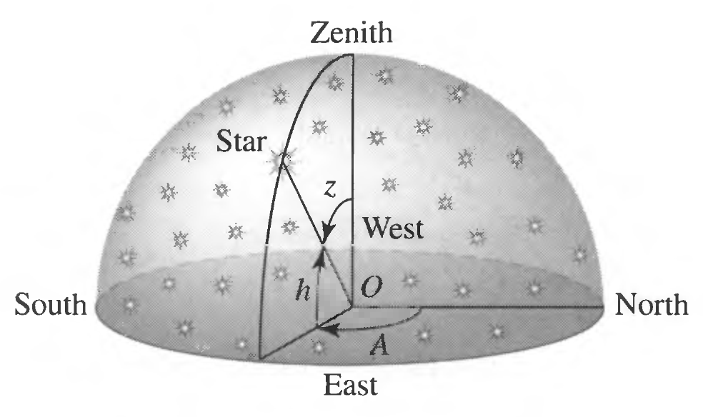
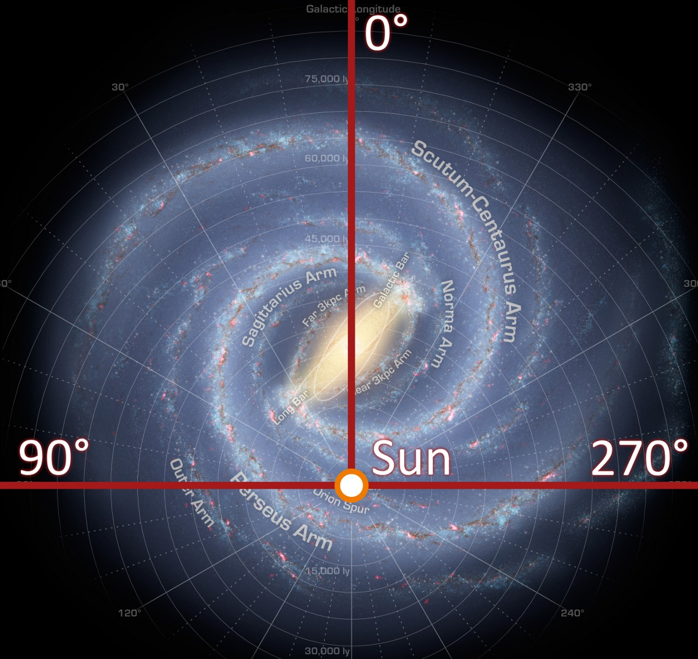
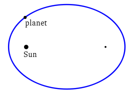
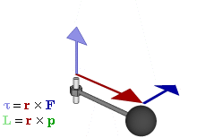
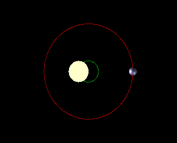
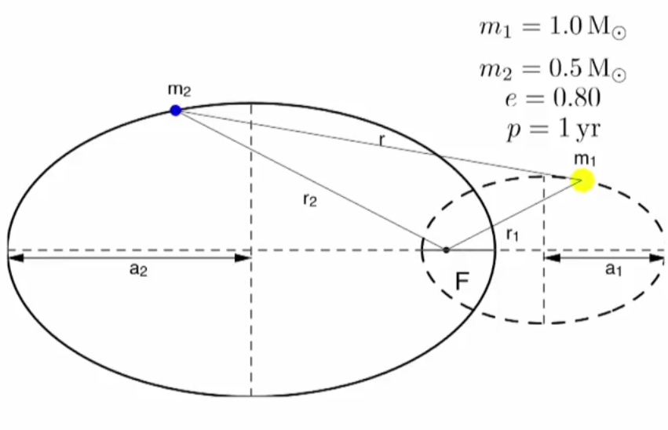

天体轨道理论
=============

这部分中，我们先讨论天体轨道的一些理论，主要是开普勒定律以及在系外行星探测中需要的“所谓修正”。

.. index:: Celestial Coordinate Systems
.. index:: 天球坐标系

坐标
--------------

在天文和天体物理中，我们使用一些特殊的坐标系。如果我们不关心距离，只关心天体的方位，那么我们只需要两个坐标就足够了。

   想想我们站在一个球形穹顶的中央，要指定一个恒星的方位，我们只需要说出图中 h 和 A 两个参数就可以了。当然我们也可以选择使用 z 和 A 来指定方位等等。选择并不是唯一。图片来自 BOB Figure 1.8.

天文上常常就是采用这样的坐标：天球坐标系统，也就是 Celestial Coordinate Systems. 由于基准位置的选取不同，又分为很多不同的坐标系统：以观测所在地的地平线为基础平面的地平坐标系统（Horizontal Coordinate System），以赤道作为基准平面的赤道坐标系统（Equatorial Coordinate System），以黄道（地球上观察太阳一年在天球上的视运动的路径）作为基准的黄道坐标系（Ecliptic Coordinate System），以及以银河系盘面作为基准的银道坐标系（Galactic Coordinate System）等等。

   银道坐标系。来源 `Wikipedia File:Galactic longitude.JPG <https://commons.wikimedia.org/wiki/File:Galactic_longitude.JPG>`_ 。银道坐标系统可以很方便地用来指定银河系中的天体的方位。

赤道坐标系是比较常用的一种坐标系统。以地球赤道对应的天球上的位置为基准平面，类似与地球上一样划分出经度和纬度，分布成为赤经（Right Ascension或对应时角）和赤纬（Declination）。

.. figure:: assets/orbits/earth_within_celestial_sphere.gif
   :align: center

   赤道坐标系。来源：`File:Earth within celestial sphere.gif <https://commons.wikimedia.org/wiki/File:Earth_within_celestial_sphere.gif>`_ 。地球赤道对应的天球上的天赤道。其中红色表示黄道，赤经和赤纬用绿色标出。

选定了基准平面，还有一个变化可以选择，即选择天球坐标固定在什么上。这里常用的选择有两个，一个是固定在地球表面也就是天球坐标随地球一起转动，这是我们用时角来表示坐标，另一个是选择是坐标固定在恒星上，不随地球转动，这是我们用赤经赤纬来表示坐标。

.. index:: Luminosity
.. index:: Magnitude
.. index:: 光度
.. index:: 星等

光度和星等
--------------

在天文上，描述一个天体有多么亮，我们有多种方法。其中比较常用的包括光度、绝对星等和视星等。

* 光度，Luminosity，其实就是辐射功率，也就是某个面积上单位时间内通过的光的能量。例如对于恒星来说，光度就是单位时间内释放的总能量。因此单位是功率单位。通常天文上使用太阳光度作为一个参考值，:math:`L_{\odot} = 3.8 W` 。
* 视星等，Apparent Magnitude，是一个用来表征我们在地球上观测到的天体的亮度的量。
* 绝对星等是在一个特定距离上的视星等。

视星等的定义是通过来自天体的光在地球上观测的时候的辐射通量来定义的。我们定义辐射通量为单位面积上单位时间内通过的光的能量，标记为 :math:`F`。视星等的定义为

.. math::
   m - m_0 = -2.5 \log_{10} \left( \frac{F}{F_0} \right),

其中，:math:`m_0` 和 :math:`F_0` 是参考天体的视星等和辐射通量。从定义看出，视星等的值越小，天体越亮。太阳的视星等是 -26.74，而月亮的视星等是 -12.74。

关于辐射通量的有趣的一点是，距离恒星越远，辐射通量就越小，因为距离越远，恒星的辐射功率被平均在了一个更大的球面上，单位面积的功率就小了。

为了去掉距离的影响，绝对星等被定义为距离恒星 10 秒差距的地方的视星等。

.. math::
   M = m + 5 \log_{10} \left( \frac{d_0}{d} \right)，

其中 :math:`d_0 = 10pc`。

.. admonition:: 视星等和绝对星等
   :class: note

   按照绝对星等的定义，

   M - m_0 = -2.5 \log_{10} \left(L/4\pi d_0^2 \right) + Constant，

   结合视星等的定义，我们得出

   .. math::
      m - M &= -2.5 \log_{10} \left( L/4\pi d^2 \right) + 2.5 \log_{10} \left( L/4\pi d_0^2 \right) \\
      & = -2.5 \log_{10} \left( \left(\frac{d}{d_0}\right)^2 \right) \\
      & = -5 \log_{10} \frac{d_0}{d}.

.. index:: Kepler's Law
.. index:: 开普勒定律

开普勒定律
------------

开普勒三定律是描述天体运动的定律，他们描述了天体轨道形状和运动状态。通过牛顿引力定律（解出运动方程），我们可以知道开普勒第三定律不仅仅适用于我们的太阳系，同时适用于其他的星系。

开普勒第一定律
~~~~~~~~~~~~~~~~~~~~~~~~~~

   开普勒第一定律：每一个行星都沿各自的椭圆轨道环绕太阳，而太阳则处在椭圆的一个焦点中。来自维基百科开普勒定律

开普勒第二定律
~~~~~~~~~~~~~~~~~~

.. figure:: assets/kepler/Kepler-second-law.gif
   :align: center
   :alt: 开普勒第二定律

   开普勒第二定律：在相等时间内，太阳和运动着的行星的连线所扫过的面积都是相等的。这其实是角动量守恒。

角动量是一个伪矢量，对于质点其定义为 :math:`\vec L = \vec r \times \vec p`，其中 :math:`\vec r` 是质点的位移矢量，而 :math:`\vec p` 是质点的动量。因此其方向是通过右手定则确定的。

   这里面球体看作质点，深绿色是动量方向，红色是位移方向，深蓝色是加速度方向。浅蓝色是力矩方向，而浅绿色是我们关心的角动量的方向。因此这里理解角动量只需要关注：球体，深绿色，红色和浅绿色。

角动量在没有外界力矩的作用下的时候，是守恒的，例如在太阳系中的行星们。从定义可以看出来，当行星距离整个体系的引力中心更近的时候，由于角动量守恒，因此只能的结果就是动量更大，从而保证 :math:`\vec r\times \vec p` 不变。[3]_

.. [3] 实际上还跟动量和位移矢量的夹角有关，此处忽略。

开普勒第三定律
~~~~~~~~~~~~~~~~~~

开普勒第三定律：各个行星绕太阳公转周期的平方和它们的椭圆轨道的半长轴的立方成正比。

.. math::
   \frac{P^2}{a^3} = \frac{4\pi^2}{GM}

开普勒三定律与系外行星探测
----------------------------------------------

想要将开普勒定律应用到行星探测中，我们有几个问题需要解决：

1. 对于开普勒定律更加严格的描述，应该是讲“太阳”改为“质心”，同时太阳变得不那么特殊，也服从开普勒定律。因为显然我们可以取两颗质量相等的天体让他们相互围绕，这时候两颗天体没有任何一颗相对于另一颗，当我们增加其中一颗的质量然后重新让他们相互围绕的时候，在质心系看来，重的一颗的半轴会越来越小，如果我们将这颗星变成无穷大质量，那么显然质心跟这颗天体重合，所有的定律都回到了原始的开普勒定律。 **对于两颗任意质量的天体的相对运动，开普勒三定律该如何修改呢**？对于第一和第二定律，只需要将太阳改为质心即可。对于第三定律，我们需要替换一些变量或者重新推导。
2. 对于多星行系统，多个行星对恒星带来的影响是什么呢？
3. 在探测一个星系的时候，星系轨道平面并不是总是垂直于我们的视线方向的，那么我们如何处理这种倾斜呢？

关于第一条，NASA 有 `两张图片 <http://spaceplace.nasa.gov/barycenter/en/>`_ 解释的很好。

   由于 Kepler 定律中的中心指的是质心，虽然太阳质量很大，但是行星的质量和太阳质量的质心依然偏离了太阳的中心。这种情况对于太阳木星这两个来说更加显著。因此实际上在质心参考系看来，太阳和行星是共同围绕质心转动的。虽然这句话看起来像是废话，但是这对于我们的系外行星探测非常重要，因我们作为一个极远处的观测者，在我们的参考系中，恒星和行星组成的体系在我们的观测时间内是近似静止的。因此获得恒星和行星体系的质心参考系下面的天体轨道才是我们需要的。

.. figure:: assets/kepler/dopspec-inline.gif
   :align: center
   :alt: Barycentric Center

   同上图。这是侧视图。

如果没有特殊说明，我们后面讨论恒星和行星的运动，都是在质心系中的讨论。

修正开普勒三定律
~~~~~~~~~~~~~~~~~~~~~~~~~~

通过简单的牛顿引力定律，我们可以推导出所谓的 barycentric oribit 的相关的定律，这里面行星和恒星相互围绕他们的质心运动。

   Barycentric Orbit. 我们将恒星和行星整体看做一个体系，在这个体系静止参考系中，他们的质心是静止的。这样我们可以描述恒星和行星各自的轨道。

此时，我们可以直观的想象到，在质心系中，两个天体（例如我们讨论的行星和恒星）有相同的周期 :math:`P`。两个天体的半长轴之比只与他们的质量有关，因为质量大的显然会距离质心更近，而质量小的天体会距离恒星更远，

.. math::
   \frac{a_1}{a_2} = \frac{m_2}{m_1}.

这正是质心系的定义而已。

.. admonition:: 进阶
   :class: note

   通过简单地将两个天体质量之和代入上面提到的开普勒第三定律中，即 :math:`M=m_1+m_2`，我们可以将两个天体对应的开普勒第三定律相关公式非常优雅的写出来，

   .. math::
      a_1 & = m_2 \left( \frac{P}{m_1+m_2} \right)^{2/3} \\
      a_2 & = m_1 \left( \frac{P}{m_1+m_2} \right)^{2/3}

   这些式子中的那些常数去哪里了呢？那些常数不在了，是因为这里使用了合适的单位（长度：AU即天文单位；质量：太阳质量；周期：年）。如果我们把上面两个式子相加，然后定义 :math:`a_r=a_1+a_2`，就可以得到一个非常简单的结果，

   .. math::
      m_1+m_2 = \frac{a^3_r}{P}

   其中 :math:`a_r=a_1+a_2`。当我面站在一个天体上的时候，这个公式变得非常有用，因为它跟两个天体之间的距离、两个天体质量和以及周期有关，而这些量是可以简单地在一个天体上测量的。

   这些公式应用与地球和太阳的情况，由于地球质量远远小于太阳质量，因此基本上退化到了太阳作为质心的情况。

   另一个处理是我们可以把两个天体分别的半长轴和半径关系的公式相除，这样可以得到一个非常简单的比值关系：两个天体的半长轴之比跟他们的质量成反比，

   .. math::
      \frac{a_1}{a_2} = \frac{m_2}{m_1}.

在系外行星的探测中，半长轴和质量之间的反比关系，

.. math::
   \frac{a_{Solar}}{a_{Planet}} = \frac{m_{Planet}}{m_{Solar}}

可以给我们一个非常重要的提示，**行星的质量越大，恒星的半长轴也越大。而大多数情况下我们看不到行星只能看到恒星，所以这也就意味着，质量越大的行星给恒星相对于质心的运动带来的影响就越大，而恒星相对于质心的运动很多情况下是我们可以通过观测看到的，因此行星质量越大，就意味着我们越容易探测到这颗行星。**

作为一些例子，我们可以看看太阳系的情况。[2]_

==========  ==============================  ==========================  ==========================
  系统      已知的行星质量（单位太阳质量）  已知的行星轨道半长轴（AU）  求得的太阳的半长轴（千米）
==========  ==============================  ==========================  ==========================
地球和太阳          :math:`3×10^{−6}`                     1                       448
----------  ------------------------------  --------------------------  --------------------------
火星和太阳         :math:`3.21×10^{−7}`                1.52                       73
----------  ------------------------------  --------------------------  --------------------------
木星和太阳         :math:`0.96×10^{-3}`                  5.20                   :math:`7.44×10^5`
==========  ==============================  ==========================  ==========================

而太阳的半径为 :math:`1.39\times 10^{6}` 千米，所以相比于太阳的半径，地球和火星能带来的太阳的移动太小，这也从一个侧面说明了系外行星探测中探测类地行星的困难。

多星行
~~~~~~~~~~~~~~~~~~~~

在多行星的系统中，行星之间的共同作用可以对恒星围绕星系质心的运动产生一些显著的效果。例如对于太阳系来说，土星和木星的联合作用比较显著，可以产生比较显著的太阳围绕太阳系质心的。

.. figure:: assets/detection/Solar_system_barycenter_pl.png
   :align: center

   太阳系的质心的变化图。图片来自 Wikipedia `File:Solar system barycenter pl.svg <http://commons.wikimedia.org/wiki/File:Solar_system_barycenter_pl.svg>`_

.. figure:: assets/detection/Solar_System_Barycenter_2000-2050.png
   :align: center

   历史上太阳位置和太阳系质心的相对变化图。其中黄色的虚线圆是太阳的大小。图片来自 Wikipedia `File:Solar System Barycenter 2000-2050.png <http://en.wikiversity.org/wiki/File:Solar_System_Barycenter_2000-2050.png>`_

这样的复杂系统中，由于我们知道在质心系中，两个天体有相同的周期 P，从而两个天体的半长轴之比只与他们的质量有关。这样就是说，这些行星对恒星的运动造成的影响，是可以线性叠加的。

.. figure:: assets/multiplanets.png
   :align: center
   :alt: 多星行系统

   多星行星系中，恒星的运动变得更加多样——各个行星对恒星的影响的叠加，即很多椭圆的叠加。

投影平面
~~~~~~~~~~~~~~~~~~~~~

在实际的观测中，我们并不一定站在恒星系统的上方或者正侧面观测的，一般而言会有一个倾斜角度。由于不能走过去把这个倾斜的恒星系统摆正，我们只好把这个倾斜角度考虑进来。

.. figure:: assets/detection/tiltedOrbitPlane.png
   :align: center
   :alt: 投影平面

   我们的视线方向并不总是跟轨道平面垂直或平行，所以我们处理的时候，需要添加一个转动矩阵。

参考和尾注
---------------

关于天体轨道理论可以参考 Carroll B. W., Ostlie D.A., An Introduction to Modern Astrophysics. 

.. [1] `开普勒定律 <https://zh.wikipedia.org/wiki/%E5%BC%80%E6%99%AE%E5%8B%92%E5%AE%9A%E5%BE%8B>`_
.. [2] 来自 `Coursera 的 The Diversities of Exoplanets <https://class.coursera.org/extrasolarplanets-001>`_

