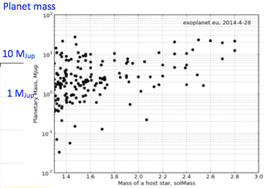

系外行星统计结果
=================

通过对系外行星的探测，我们获得了大量的数据，并得出了一些统计结果。通过这些数据分析，我们能修正行星演化的模型并做出预测。

.. admonition:: 一个谜团
   :class: warning

   第一颗确认的系外行星 `51 Peg b <http://zh.wikipedia.org/zh-cn/%E9%A3%9B%E9%A6%AC%E5%BA%A751b>`_ 是一颗“热木星”——质量巨大，然而这颗行星距离其恒星却非常近——甚至要比太阳系内任意一颗行星到太阳的距离。可是问题在于，距离恒星这么近的地方，并没有足够的质量来形成一颗这么巨大的行星。

   谜题的答案是，这颗行星实际上是在距离恒星更远的地方形成的，但是在形成的过程中以及形成之后，这颗行星在周围物质的作用下，逐渐损失能量，轨道原来越小。

   然而这给我们带来另一个问题，为什么这颗行星没有因为损失太多的动能和势能，从而掉进恒星中去呢？

另外，我们对于地外生命的好奇心，也驱使着我们去寻找宜居带中的类地行星。

行星质量-距离-半径
-----------------------------

早期统计结果
~~~~~~~~~~~~~~

自1995年第一颗系外行星 `51 Peg b <http://zh.wikipedia.org/zh-cn/%E9%A3%9B%E9%A6%AC%E5%BA%A751b>`_ 被发现一直到2004年，天文学家一共发现了大约130颗系外行星，并根据这些数据得出了一些初步的结论：

1. 1%的太阳型恒星有“热木星”。

2. 至少7%的太阳型行星拥有至少一颗行星。

3. 已发现的行星(大多是气态巨行星)出现在富金属恒星附近的概率更高。

4. **行星轨道、行星系统多种多样。** 这是最令人惊讶的一个结果：行星不但普遍，而且多种多样。

.. admonition:: Advanced
   :class: note

   现已发现的系外行星根据其半径、组成和轨道半径大体可以分为以下五类：[1]_

   1. 热木星(Hot Jupiter):质量接近或超过木星,行星轨道与母恒星距离在0.5至0.015天文单位以内。

   2. 气态巨行星(Gas gaint):与木星、土星类似的行星。

   3. 冰巨星(Ice gaint):与天王星、海王星类似的行星。

   4. 超级地球(Super-Earth):质量约为地球的2.5到10倍的岩质行星。

   5. 迷你海王星(Mini-Neptune):质量低于天王星和海王星，但组成却和海王星相当类似。

   .. figure:: assets/statistics/The_variety_of_exoplanets.jpg
      :align: center
      :alt: 系外行星的种类

   早期发现的系外行星，质量分布在0.2木星质量~20木星质量之间，轨道周期大于2.5天，轨道偏心率分布在0~0.93之间。

   .. figure:: assets/statistics/Extrasolar_planets.jpg
      :align: center
      :alt: 早期统计结果概览

系外行星系统的多样性
~~~~~~~~~~~~~~~~~~~~~~

对于同一系外行星系统，其内部行星的轨道有可能有很大差异。根据径向速度测量法的相关知识，我们可以根据径向速度测量曲线大致判断行星轨道的偏心率。

.. figure:: assets/statistics/small_eccentricity.jpg
   :align: center
   :alt: 小偏心率轨道

上图所示的径向速度曲线与正弦曲线相似，因此该行星的偏心率很小，近似于圆轨道。

上图所示的阶跃型曲线表示该行星轨道的偏心率相当大。

如果行星系内的两颗行星的轨道周期相差很大，就会形成分层系统(Heirarchized System)，其径向速度曲线可以看做是两个频率相差很大的波形的叠加。
如果行星系内的两颗行星的轨道周期成整数倍，就会形成共振系统(Resonant System)，其径向速度曲线变化很快，要分辨出这是两颗行星比较困难，需要花更长的时间。

.. figure:: assets/statistics/different_curves.jpg
   :align: center
   :alt: 不同曲线形状

.. note::
   分层系统（Heirarchized System）中，两颗行星的周期没有确定的关系，两颗行星的周期是任意的。而共振系统（Resonant System）的意思是说，行星的轨道周期之间有确定的关系，例如两颗行星轨道周期之比是 2 等等。

如果行星系的中心天体是两颗互相旋转的双星，那么情况又有所不同。由于双星的运动对行星轨道的影响，在双星的一定范围内无法形成稳定的行星轨道，只有在范围以外，行星轨道才可以稳定。

.. figure:: assets/statistics/Planets_in_binaries.jpg
   :align: center
   :alt: 双星中的行星

不同种类的系外行星系统展示在下图中：

.. figure:: assets/statistics/The_Kepler_Orrery.gif
   :align: center
   :alt: 多种行星系统

.. figure:: assets/statistics/The_Kepler_Orrery2.gif
   :align: center

   来源：`Kepler Orrery - Daniel Fabrycky | Nasa <http://kepler.nasa.gov/multimedia/animations/scienceconcepts/?ImageID=136>`_

行星的分布、质量及距离
~~~~~~~~~~~~~~~~~~~~~~~~

在系外行星探测中，径向速度法和凌日法是最主要的两种方法，这两种方法各有局限性：

`径向速度法 <http://exoplanets.readthedocs.org/zh_CN/latest/detection.html#id2>`_ 通过测量恒星光谱微小的变化来探测行星，这种方法能够准确测量行星的周期和质量，但却无法测量行星的半径。 `凌日法 <http://exoplanets.readthedocs.org/zh_CN/latest/detection.html#id7>`_ 通过测量恒星亮度的微小变化来探测行星，这种方法能够准确测量行星的周期和半径，但却无法测量行星的质量。

我们可以通过比较HARPS和Kepler年具体看看两种方法各自的适用范围：

1. HARPS(径向速度法)对于周期小于50天的行星，最小能测出 :math:`m_p \sin i \approx 3M_{\oplus}` 的无偏分布。

2. Kepler(凌日法)对于周期小于50-100天的行星，最小能测出 :math:`R_p \approx 1R_{\oplus}` 的无偏分布。

由于两种方法各自的局限性，它们并不能得出完整的行星分布，因此需要对结果进行修正。

.. figure:: assets/statistics/Correction1.jpg
   :align: center
   :alt: 分布修正1

.. figure:: assets/statistics/Correction2.jpg
   :align: center
   :alt: 分布修正2

   径向速度法主要分布中对质量较小、周期较长的部分进行修正。

.. figure:: assets/statistics/Correction3.jpg
   :align: center
   :alt: 分布修正3

   凌日法主要对分布中半径较小，周期较长的部分进行修正。

在修正之后，得到了无偏的行星质量、半径分布，如下图所示：

.. figure:: assets/statistics/Unbiased_distribution.jpg
   :align: center
   :alt: 无偏分布

另外，通过比较母恒星Fe/H的比值与行星数量的关系，我们可以得出母恒星的金属性与行星的关系：

.. figure:: assets/statistics/Metallicity.jpg
   :align: center
   :alt: 金属性

综合分析HARPS与Kepler数据，我们可以得出以下结论：

1. 1%的恒星拥有热木星，其存在于富金属恒星周围的概率更大。

2. 10%的恒星拥有气态巨行星，其存在于富金属恒星周围的概率更大。

3. 较小的恒星几乎没有气态巨行星。

4. 50%-80%的恒星拥有至少一颗行星。

5. 30%的恒星拥有一颗 :math:`m_p < 30M_{Earth}` ，周期100天以内的行星。

6. 大多数较小较轻的行星存在于多行星系统中。

7. 存在一颗 :math:`m_p \sin i < 30M_{Earth}` 行星的行星系中，超过70%还存在其他行星。

8. 行星系所能允许的致密程度能使其“刚好”稳定。

行星质量与半径的关系
~~~~~~~~~~~~~~~~~~~~~

由于径向速度法、凌日法所测行星数据的重点并不相同，两者之间具有很好的互补性，如将数据结合的话，可以得到行星质量与半径的关系，这对于研究行星的内部结构十分重要。即使两个天体大小相同，如果其质量差异较大，其内部结构也将存在很大差异。例如气态巨行星(如木星)和红矮星(如OGLE-TR-122b)具有相同的半径，但由于木星质量没有OGLE-TR-122b大，其内部无法发生核反应，因此前者属于行星，后者属于恒星。

.. figure:: assets/statistics/Mass_and_radius.jpg
   :align: center
   :alt: 红矮星与木星

可见，了解行星质量与半径的关系对于行星分类具有重要作用，进而还可了解的行星的形成过程。
最新的系外行星质量-半径关系如下图：

.. figure:: assets/statistics/Mass-radius.jpg
   :align: center
   :alt: 质量与半径关系

观测与理论
~~~~~~~~~~~~~~

通过观测，我们能够验证观测数据与理论是否符合，并能对理论进行修缮。而有了更好的理论，就能为未来的观测提供更好的方向。
下图展示了一个行星演化模型中，行星轨道半长轴、行星质量随时间变化的规律：

.. figure:: assets/statistics/Synthesis.gif
   :align: center
   :alt: 模拟

   来源：`W. Benz, S. Ida, Y. Alibert, D.N.C. Lin, C. Mordasini. Planet Population Synthesis <http://arxiv.org/abs/1402.7086>`_

而对系外行星的实际观测的结果如下：

.. figure:: assets/statistics/observation.jpg
   :align: center
   :alt: 实际观测

更多的观测与理论符合的情况可以见上述论文与课程视频，在此不一一赘述。
未来我们对于系外行星的观测方向主要将集中于：

1. 获取更大量的数据。

2. 更多探测方法的优势互补。

3. 特定行星系统的具体分析，包括：

   -行星轨道参数

   -行星内部结构

   -行星大气层

4. 与理论相符

行星的轨道特征和星系的结构
-----------------------------------------

恒星质量
~~~~~~~~~~~~~~~

一个直观的想法是，形成恒星系的原行星盘（Protoplanetary Disk）越大，形成的恒星的质量越大。同时因为更多的尘埃物质会使得行星的形成更快，而且最终的行星也更大。所以，按照这个想法，围绕大恒星转的行星的质量也会普遍大么？

RV 方法给出了一些数据表明[2]_ ，M Dwarfs 周围的大行星很少，相反，超级地球（Super-Earth）和迷你海王星（Mini-Neptune）出现的频率非常大。而开普勒的结果也表明[3]_ ，在 M Dwarf 周围几乎没有巨行星。

.. note::
   我们可以把观测结果绘制成频率图，这样就可以发现不同的质量区间的行星出现的频率。

那么在质量更大的恒星周围的行星的情况呢？

.. figure:: assets/statistics/massOfHostStar.png
   :align: center

   从这个分布图中我们可以看到，我们确实发现了很多围绕大质量恒星转动的行星。(Exoplanet encyclopedia @ exoplanet.eu)

目前的数据来看，更大的恒星周围确实会有更大的行星。

然后，特别需要注意的是，因为探测大质量恒星周围的小质量行星很困难，所以现在的数据其实是带偏离的数据。所以我们不能直接来拿不同质量行星的出现的频率来跟之前比较。

一个比较好的方法是[4]_，统计行星总质量。例如我们可以将恒星质量分为三个区间，然后将每个区间内的所有的行星的质量求和，然后做归一化。

   显然，恒星的质量越大，周围的行星的总质量也越大。

.. [1] 来自 `WikiPedia <http://zh.wikipedia.org/wiki/Template:%E7%B3%BB%E5%A4%96%E8%A1%8C%E6%98%9F>`_
.. [2] Bonfils et al. 2012, A&A
.. [3] Dressing & Charbonneau et al. 2013, ApJ
.. [4] Lovis & Mayor, 2007.
