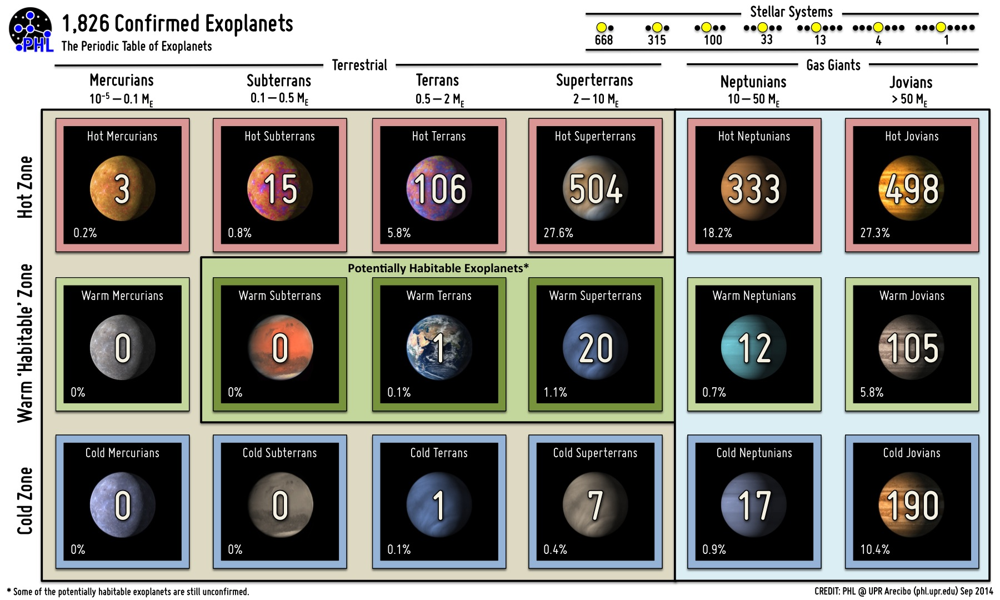
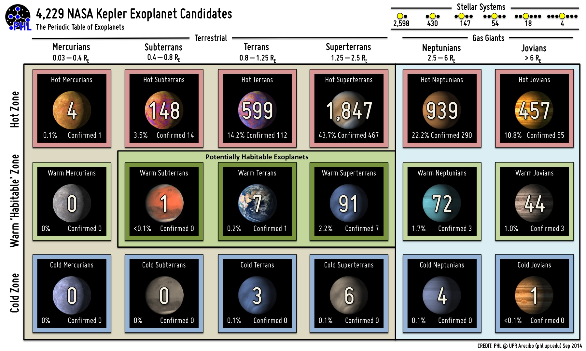

系外行星的分类和可视化
=====================

.. index:: 系外行星周期表

系外行星周期表
-----------------

PHL 的 Habitable Exoplanets Catalog 里面有个分类方法是将系外行星按照轨道分为 Hot Zone, Habitale Zone, Cold Zone. 另外按照行星的状态分为 Mercurians, Subterrans, Terrans, Superterrans, Neptunians 和 Jovians.

+--------------+----------------+---------------------+--------------+
|     分类     |   太阳系举例   | 质量（地球质量为1） |     描述     |
+--------------+----------------+---------------------+--------------+
|  Mercurians  |   水星，月球   |     10^-5 ~ 0.1     | 小质量、球形 |
+--------------+----------------+---------------------+--------------+
|  Subterrans  |      火星      |      0.1 ~ 0.5      |              |
+--------------+----------------+---------------------+--------------+
|    Terrans   |   地球，金星   |       0.5 ~ 2       |              |
+--------------+----------------+---------------------+--------------+
| Superterrans |                |        2 ~ 10       |              |
+--------------+----------------+---------------------+--------------+
|  Neptunians  | 天文星，海王星 |       10 ~ 50       |              |
+--------------+----------------+---------------------+--------------+
|    Jovians   |   木星，土星   |         >50         |              |
+--------------+----------------+---------------------+--------------+

   图片来自：PHL `http://phl.upr.edu/projects/habitable-exoplanets-catalog/media/pte`  CREDIT: PHL @ UPR Arecibo.

   图片来自：PHL `http://phl.upr.edu/projects/habitable-exoplanets-catalog/media/pte`  CREDIT: PHL @ UPR Arecibo.

.. figure:: assets/viscat/PT_Solar_System.jpg
   :align: center

   图片来自：PHL `http://phl.upr.edu/projects/habitable-exoplanets-catalog/media/pte`  CREDIT: PHL @ UPR Arecibo.

